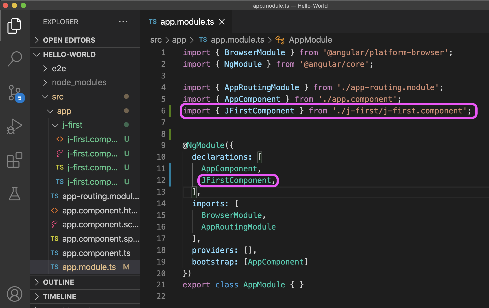

# Angular 学习笔记


## Angular开发环境安装

1.  下载安装 Nodejs。到官网：https://nodejs.org 下载安装Node.js稳定版本。我们主要是想用 NPM（Nodejs Package Manager）这个软件包管理工具，来安装 AnguarCLI 命令行工具。
2. 在终端命令行，用NPM来安装 AngularCLI 工具。

 ```shell
zsh.$ sudo npm install -g @angular/cli
Password:
 ```

	3. 安装Typescript

```shell
zsh.$ sudo npm install -g typescript
Password:

zsh.$ tsc --version
Version 4.0.3
```


## 创建一个Angular新项目

1. 用 ng 创建一个Angular新项目

```shell
zsh.$ ng new Hello-World
```

2. 启动一个本地 Web 服务器

```shell
zsh.$ ng serve

** Angular Live Development Server is listening on localhost:4200, open your browser on http://localhost:4200/ **
```

3. 用浏览器打开 http://localhost:4200 就能看到一个欢迎页面。


上图：ng new Hello-World 命令自动生成的第一个简单Angular Web 应用。运行在本机的Live Webserver上，可以通过浏览器localhost的4200端口访问。


## 理解Angular应用的启动逻辑


Angular应用的启动逻辑（bootstrap)：

1. 读取index.html文件，并指向下跳 main.ts。

   这是浏览器访问一个URL网址的默认方式，不指定确定的html文件就默认查找index.html。如果找不到浏览器就会返回著名的 404 错误，说要访问的页面找不到。


上图：浏览器装载index.html文件后，就会找<app-root/>，这个暂时不需要知道是什么怪物。它总会指向Angular程序文件 main.ts，把程序运行接力棒交给这个默认应用入口 Typescript 程序。


2. mian.ts 指向下一跳 AppModule.ts


3. AppModules 也玩踢皮球游戏，指向下一跳 AppComponent 


4. App.component.ts 才是真正干活的好员工


上图：component是Angular框架的核心概念，它由负责长得怎么样（view）的模版（也就是一个html文件）和负责对交互如何响应的类程序组成。在这个简单的应用中，AppComponent类没做什么事情，只是存储了一个字符串变量title。连一个method方法都没有，更不会去调用一个外部的服务真正做一点有意思的事情。


## 用ng g c 命令创建新组件

1. ng 命令创建组件

在VSCode的集成终端命令行上，运行 ` ng g c jFirst` ，创建一个新组件（Component）。这里参数` g` 表示“generate”，` c` 表示“ component”。


上图：看右下角，执行命令后ng 自动创建出4个新文件，并更新了app.module.ts文件。在左侧的app文件夹里已经显示出了这4个新文件。

但是，我们本来希望创建一个名称为 jFirst 的组件，还得意得使用了驼峰命名规范（Camel naming convention），可 ng 没给我们留一点面子，直接按照 Typescript 命名规范把组件名改为 j-first 了，单词用中间线（dash）连接，首字母都小写。意思是说：“嗨，新来的，懂点规矩，入乡随俗！” 


2. 自动注册组件

ng工具自动在app.module.ts 文件中注册新创建的组件。




## 理解Angular组件


上图：一个典型的组件定义文件

- Angular用 ` @Component` 修饰词（decorator ）前缀来定义一个组件。也就是说，一旦Angular看到这个修饰词出现，就知道后面的代码是要定义一个组件，随后就会做响应的解析，最终会转换成原生的 Typescript 语言代码。

- Component 组件文件由两部分构成。第一部分是元数据（ Metadata），其中最重要的是定义了这个组件视图（View）的html模版，或者指出定义模版的文件。第二部分是一个Typescript 的类（class），决定组件的行为逻辑（action logic）。

- 元数据由三部分组成：选择器（selector）、模版（template）和CSS样式（style）。

- 选择器，跟CSS里的选择器概念基本是一样的，也就是说一旦Angular在html文本中发现这里定义的选择器，就用这个组件替换，因为它就是代表组件本身。

  ```html
  <!-- 在父组件的html模版文件（这里是app.component.html）中总会有这么一行tag，用于引用子组件(app-j-first组件)：-->
  
  <div>  
  <app-j-first></app-j-first>
  </div>
    
  <!-- <app-j-first></app-j-first> 选择器就代表了组件本身，Angular会将组件 app-j-fisrt的模版html文件整个替换插入。-->
  ```


- Angular选择器有3种方式定义选择器。

  ```html
  <!-- 第一种方式：
  @Component{
    selector: 'app-j-first'
  } 
  父组件的html文件要用tag格式引用： -->
  
  <div>  
  <app-j-first></app-j-first>
  </div>
  
  <!-- 第二种方式：
  @Component{
    selector: '.app-j-first'
  } 
  父组件的html文件要用class属性定义格式引用： -->
  
  <div class="app-j-first">  </div>
  
  
  <!-- 第三种方式：
  @Component{
    selector: '[app-j-first]'
  } 
  父组件的html文件要用属性格式引用： -->
  
  <div app-j-first>  </div>
  
  ```

- 模版（template），就是一段html文档，整个应用的html文档中的一个模块。那为什么不叫模块呢？因为它可能是一个没有完成的html文档块，在这个文档块里面通常有很多部分是要动态生成的，这里还只是存在着很多空洞需要填充的模板。这个动态填充的工作正是class部分要做的，它可能需要到服务器去查询一些数据，比如，工资，出生日期之类。

- 有两种方式来定义模板：

  ```typescript
  //第一种方式：inline template
  @Component{
  template: `<div>
                inline template 行内直接书写的模板
              </div>`,
   }
   
   //第二种方式：指定html文件的URL位置
             
   @Component{
  templateUrl: './j-first.component.html',
   }
  ```

- 样式（style），就是CSS样式文件。每一个Angular的组件都有一个自己的CCS样式，可以是 inline方式的，也可以是指向一个CSS样式文件。仅用于为本组件模板html文档定义样式（这里是 ./j-first.component.html）。

  ```typescript
  // inline 行内书写
  @Component{
  styles: [`div{color:red;}`],
   }
  
  // 指向一个scss文件
  @Component{
  styleUrls: ['./j-first.component.scss'],
   }
  ```

  