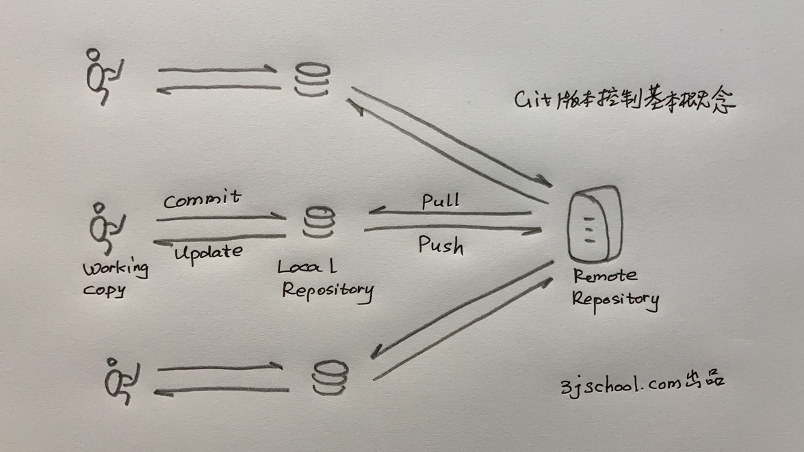

# Git 学习笔记


## Git 的基本概念

- Git 是一种VCS，版本控制系统（Version Control System，有人也叫它版本管理系统） 。版本控制系统主要就是要管理一组文件的变化历史，每一个时间基线对应一个版本。
- Git 是 Distributed VCS，分布式VCS，就是支持多人协同开发。每一位开发者有一份完整的拷贝在本地机器上。居于中心的服务器负责协调写冲突和版本同步。

 

此处必须上图了，否则说不清楚。

- 对于程序员来说，你要面对3分拷贝：Working Copy，Local Repository 和 Remote Repository。
-  Working Copy。也叫working tree，就是你正在编码的一组文件，我们就叫它工作拷贝吧。比如用Visual Studio Code读写的程序代码。你写呀写呀，改呀改的那些代码文件。实际上，在VSCode上做修改（change）的时候，changes分成两个状态，changes 和 staged changes。commit之前先要把changes “+”到 staged changes 区域，才能 commit到 Local Repository。
- Local Repository，本地代码仓库。你如果从来没有用过任何版本管理系统（VCS），会觉得这玩意儿有点诡异。我正在编写的代码文件，存储在我的本地磁盘上，是持久化的存储呀，难道不就是存储代码的仓库吗？你一脸困惑地发问。是的，你本地文件系统上的工作拷贝（Working Copy）一般不会丢失，可是会被你不断地修改，包括错误地修改。安装了Git这类版本管理系统之后，你可以定期“提交（commit）”你的成果到本地代码仓库封存起来，贴上标签，说这是某某版本，Version x.y.z。
- Remote Repository，远程代码仓库。它要负责管理整个项目开发团队提交上来的所有代码，是一个项目的公共代码仓库。显然它除了具有本地代码仓库的版本控制功能外，还必须处理好一个开发团队内各个程序员提交代码时的冲突问题。如果两个程序员要同时修改同一个文件怎么办？必须有一种控制机制，这个当然一点都不难理解。一个项目的所有程序员都必须基于同一套版本文件进行修改，在你进入一个项目开始开发之前，你必须先把远程的版本文件 Pull 到本地代码仓库，基于这个共同的基础来开发新功能走向更加美好的未来。
- commit 和 push。你写好代码之后，需要两步才能把代码提交到远程项目代码仓库上去。第一步，你要把刚写好的代码“提交（commit）”到本地代码仓库（local Repository）；第二部，你要 push 你的工作成果到远程项目代码仓库（Remote Repository）。
- 


## 创建代码仓

### 1.  创建代码仓 git init 和 git clone
初始化创建 Local Repository，有两种方法：
1. git init 将一个本地文件目录初始化为一个版本仓库。初始化以后这个目录的所有文件就开始受到git的版本控制。说得更通俗一点，就是git将会监控和记录下这个目录下所有文件的改变历史。

2. git clone 从一个远程版本库客隆，在本地生成一个一摸一样的版本仓库文件目录。
   例如：git  clone https://github.com/3jschool/homepage

   

所谓的版本仓库（Repository），其实就是在相应的文件目录里多了一个 .git 文件，存有git repository的管理信息。因此要想把这个版本仓库文件目录变成普通的文件目录，只要用 “rm -rf .git”命令删除这个 .git文件就可以了。可以再用“git show”命令确认一下这个目录还是不是一个git版本仓库。

### 2.  查看代码仓 git show


### 3.  删除代码仓 rm  -rf 

```shell
zsh.$ rm -rf .git
zsh.$ git show
fatal: not a git repository (or any of the parent directories): .git
```


## 提交代码到仓库

###  1.  git status
查看工作区（working tree）代码与入库缓存区（stage）的差别

### 2.  git add

把工作区的变化（changes）提交到stage缓存区

### 3. git commit -m '版本注释'

把缓存区的变化提交到本地的代码仓

### 4. git push origin master

把本地代码仓的变化推送到远端代码仓（比如，github repo）


