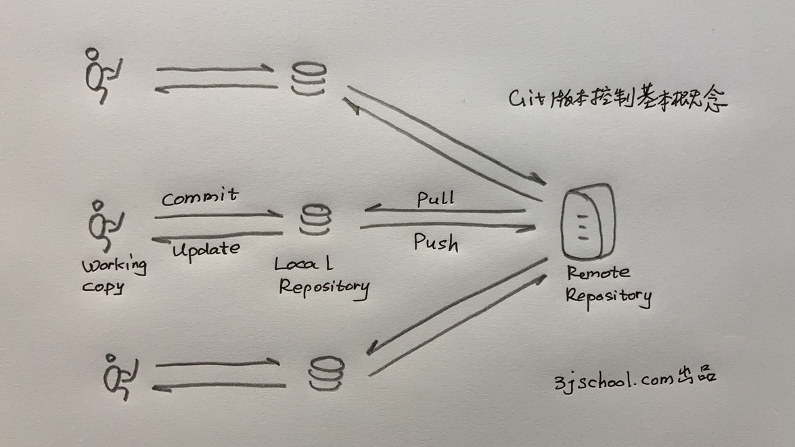

# Git Visual Studio学习笔记


## Git 的基本概念

- Git 是一种VCS，版本控制系统（Version Control System，有人也叫它版本管理系统） 。版本控制系统主要就是要管理一组文件的变化历史，每一个时间基线对应一个版本。
- Git 是 Distributed VCS，分布式VCS，就是支持多人协同开发。每一位开发者有一份完整的拷贝在本地机器上。居于中心的服务器负责协调写冲突和版本同步。

 

此处必须上图了，否则说不清楚。

- 对于程序员来说，你要面对3分拷贝：Working Copy，Local Repository 和 Remote Repository。
-  Working Copy。也叫working tree，就是你正在编码的一组文件，我们就叫它工作拷贝吧。比如用Visual Studio Code读写的程序代码。你写呀写呀，改呀改的那些代码文件。实际上，在VSCode上做修改（change）的时候，changes分成两个状态，changes 和 staged changes。commit之前先要把changes “+”到 staged changes 区域，才能 commit到 Local Repository。
- Local Repository，本地代码仓库。你如果从来没有用过任何版本管理系统（VCS），会觉得这玩意儿有点诡异。我正在编写的代码文件，存储在我的本地磁盘上，是持久化的存储呀，难道不就是存储代码的仓库吗？你一脸困惑地发问。是的，你本地文件系统上的工作拷贝（Working Copy）一般不会丢失，可是会被你不断地修改，包括错误地修改。安装了Git这类版本管理系统之后，你可以定期“提交（commit）”你的成果到本地代码仓库封存起来，贴上标签，说这是某某版本，Version x.y.z。
- Remote Repository，远程代码仓库。它要负责管理整个项目开发团队提交上来的所有代码，是一个项目的公共代码仓库。显然它除了具有本地代码仓库的版本控制功能外，还必须处理好一个开发团队内各个程序员提交代码时的冲突问题。如果两个程序员要同时修改同一个文件怎么办？必须有一种控制机制，这个当然一点都不难理解。一个项目的所有程序员都必须基于同一套版本文件进行修改，在你进入一个项目开始开发之前，你必须先把远程的版本文件 Pull 到本地代码仓库，基于这个共同的基础来开发新功能走向更加美好的未来。
- commit 和 push。你写好代码之后，需要两步才能把代码提交到远程项目代码仓库上去。第一步，你要把刚写好的代码“提交（commit）”到本地代码仓库（local Repository）；第二部，你要 push 你的工作成果到远程项目代码仓库（Remote Repository）。
- 


## Git常用命令


### git init 和 git clone
初始化创建 Local Repository，有两种方法：
1. git init 将一个本地文件目录初始化为一个版本仓库。初始化以后这个目录的所有文件就开始受到git的版本控制。说得更通俗一点，就是git将会监控和记录下这个目录下所有文件的改变历史。

2. git clone 从一个远程版本库客隆，在本地生成一个一摸一样的版本仓库文件目录。
   例如：git  clone https://github.com/3jschool/homepage

   

所谓的版本仓库（Repository），其实就是在相应的文件目录里多了一个 .git 文件，存有git repository的管理信息。因此要想把这个版本仓库文件目录变成普通的文件目录，只要用 “rm -rf .git”命令删除这个 .git文件就可以了。可以再用“git show”命令确认一下这个目录还是不是一个git版本仓库。

```shell
zsh.$ rm -rf .git
zsh.$ git show
fatal: not a git repository (or any of the parent directories): .git
```


## Visual Studio Code 是什么？

Visual Studio Code是微软开发的免费开源工具，是一种最流行的代码编辑器 （Code Editor）。通俗地说就是程序员写代码的工具，就如同Office word是作家文章的工具一样。

本质上讲，用什么写程序代码都一样。可以用记事本，可以用Linux的 vim，只要能写字就行。不同的是，VS Code这类代码编辑工具会提供一些提高写代码效率的功能。比如，自动联想出主要程序语言的关键字，你输入'pr'，它马上联想出'print'，你回车就可以了。更有用的一个功能是，帮你做语法检查，提示你明显的语法错误（syntax error），比如少了一个括号。

常用的几款代码编辑器有：

- Visual Studio Code
- Atom
- Sublime


## IDE 和 Code Editor

与Code Editor相对应的写代码的工具是IDE （Integrated Developer Environment ，集成化开发环境）工具。与代码编辑器工具不同的是，IDE增加了更多的功能，是一种更加重载的工具平台。

相比代码编辑器，IDE在以下功能上更加强大：

- linting，代码静态分析，就是在你还没有运行调试之前，就能根据语法发现代码明显的错误。
- Debugging，可以在IED内调试代码，也就是集成了运行环境，比如，Python的解释器，Java的JVM运行时环境
- Auto-completion ，自动补齐，写代码又快又正确。
- Code Formatting，自动调整格式，比如缩进对齐，这样就有一个好的排版，更容易阅读。
- Unit Testing，自己开发的单元模块测试功能。
- Code Snippets，帮助把一些常用的程序代码形成可重复使用的模块，不需要重复地一句句输入了。比如，输入'CC'自动生成 create class 的代码块，这可以大大提高输入（type）代码的效率。

常用的几款IDE有：

- eclipes
- PyCharm
- jetBrain


## 文件目录是软件代码的容器

所有的软件项目都是以一个项目目录来管理其代码文件的。文件之间的相互引用关系也是以文件在目录及其子目录的位置为基础的，也就是说其中任何一个文件代码的位置（相对于项目根目录的位置）不能随意变动，否则会影响调用，找不到这个文件了。


上图：“counter” 是一个软件项目根目录在Mac OS文件系统里的样子。这个项目也通常叫做“counter”项目。程序员的工作就是写（edit）这些代码文件，并存储在项目目录下的某个文件里。


上图：用 VS Code 打开的counter项目目录在工作空间的样子。

