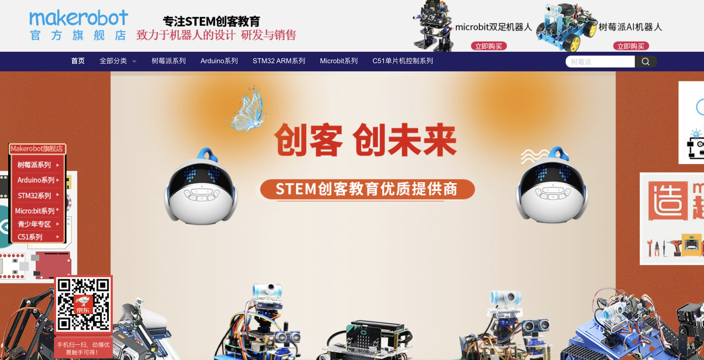
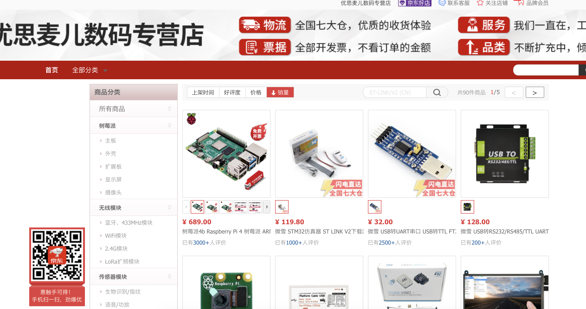
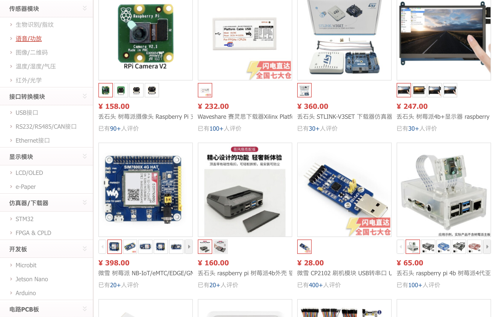
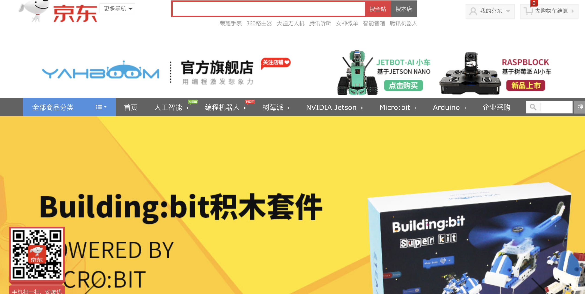
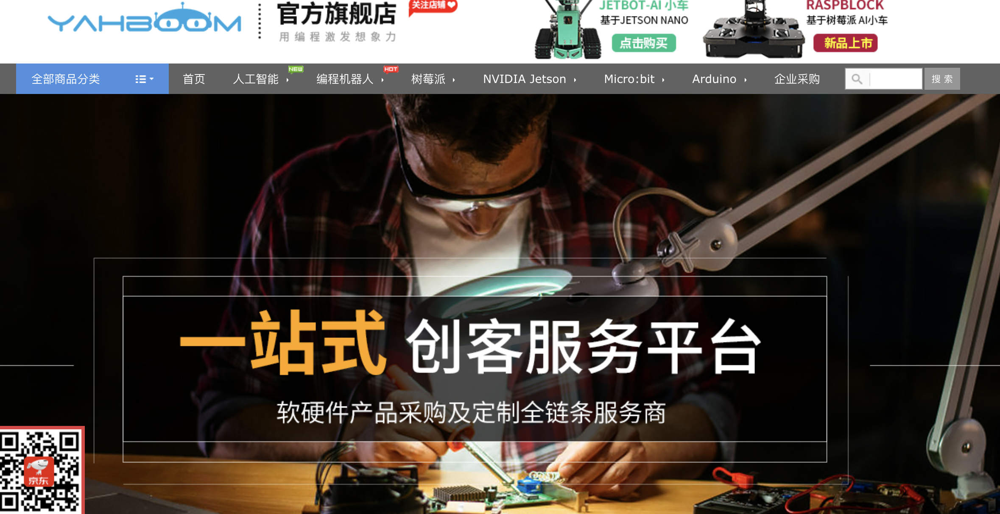
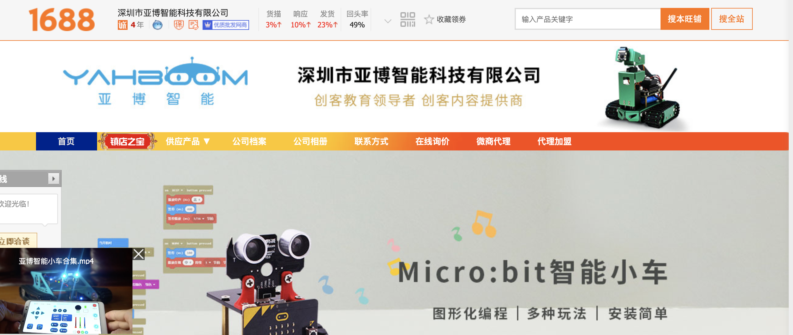

# 树莓派项目文档

# 友商研究

第一件事情，知己知彼，研究市场格局。

已经有不少商家进入这个市场了，应验了那句话，任何生意都充满了竞争者。这些商家主要通过卖设备，同时提供一些光盘教材来促进销售产品。三阶学校相反，我们提供优质课程为主，顺便也销售产品。将来公司的主要研发力量是研发课程，产品可以从其它商家订购，或者代工。如何降低产品采购或代工的成本，还需要研究市场的每一个环节。

做生意，跟做其它工作一样，无非就是深入地研究和思考，找到其中的改进点。

## 创乐博京东店

这是一家湖南的公司，在京东上有旗舰店，居然没有自己的官网，看来是生产电子硬件的。在京东上卖的学习套件，几种流行的微型主版都包含了，还自己开发了一款与Arduino兼容的主板。

- Micro: bit，英国BBC 2016年推出学习主板。
- C51单片机，Intel 8051指令集兼容机
- Arduino，意大利的开源主板
- 树莓派卡片电脑
- STM32，他们自己开发的兼容 Arduino的主板

## Makerobot京东店

宣称专注STEM教育，跟我的想法一样的。奇怪的是，这家也没有官网。仔细研究发现，其实跟创乐博是同一家公司，开了一个不一样的店。这是电商开店的标准套路吗？

## 优思麦儿数码专营店京东

卖散件为主，销量比较大。

## 亚博智能京东店

提供企业用户采购，可以仔细研究一下。初期可以通过跟这样的供应商合作来开展生意。

