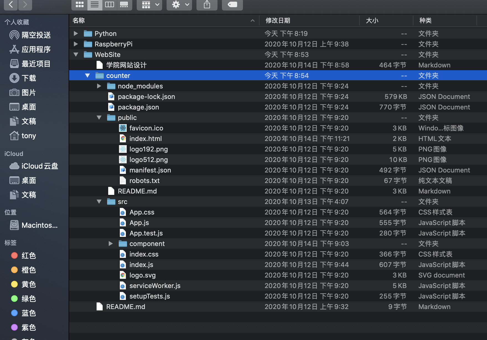
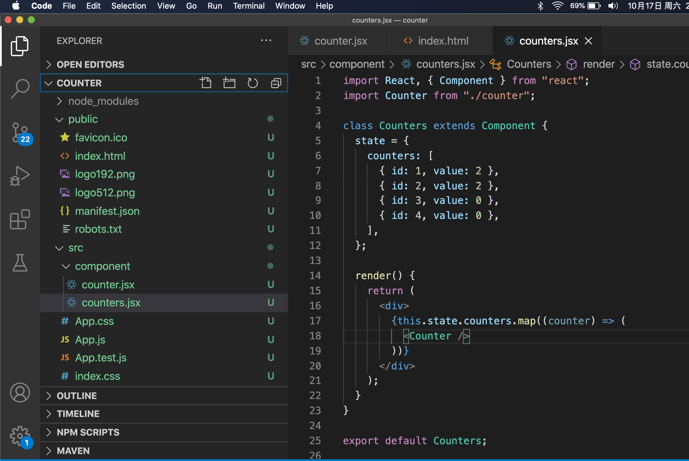

# VS Code 学习笔记

## Visual Studio Code 是什么？

Visual Studio Code是微软开发的免费开源工具，是一种最流行的代码编辑器 （Code Editor）。通俗地说就是程序员写代码的工具，就如同Office word是作家文章的工具一样。

本质上讲，用什么写程序代码都一样。可以用记事本，可以用Linux的 vim，只要能写字就行。不同的是，VS Code这类代码编辑工具会提供一些提高写代码效率的功能。比如，自动联想出主要程序语言的关键字，你输入'pr'，它马上联想出'print'，你回车就可以了。更有用的一个功能是，帮你做语法检查，提示你明显的语法错误（syntax error），比如少了一个括号。

常用的几款代码编辑器有：

- Visual Studio Code
- Atom
- Sublime

## IDE 和 Code Editor

与Code Editor相对应的写代码的工具是IDE （Integrated Developer Environment ，集成化开发环境）工具。与代码编辑器工具不同的是，IDE增加了更多的功能，是一种更加重载的工具平台。

相比代码编辑器，IDE在以下功能上更加强大：

- linting，代码静态分析，就是在你还没有运行调试之前，就能根据语法发现代码明显的错误。
- Debugging，可以在IED内调试代码，也就是集成了运行环境，比如，Python的解释器，Java的JVM运行时环境
- Auto-completion ，自动补齐，写代码又快又正确。
- Code Formatting，自动调整格式，比如缩进对齐，这样就有一个好的排版，更容易阅读。
- Unit Testing，自己开发的单元模块测试功能。
- Code Snippets，帮助把一些常用的程序代码形成可重复使用的模块，不需要重复地一句句输入了。比如，输入'CC'自动生成 create class 的代码块，这可以大大提高输入（type）代码的效率。

常用的几款IDE有：

- eclipes
- PyCharm
- jetBrain

## 文件目录是软件代码的容器

所有的软件项目都是以一个项目目录来管理其代码文件的。文件之间的相互引用关系也是以文件在目录及其子目录的位置为基础的，也就是说其中任何一个文件代码的位置（相对于项目根目录的位置）不能随意变动，否则会影响调用，找不到这个文件了。

上图：“counter” 是一个软件项目根目录在Mac OS文件系统里的样子。这个项目也通常叫做“counter”项目。程序员的工作就是写（edit）这些代码文件，并存储在项目目录下的某个文件里。

上图：用 VS Code 打开的counter项目目录在工作空间的样子。

